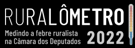

----
 O Ruralômetro é um banco de dados e uma ferramenta interativa que avalia a atuação dos deputados federais nas questões ligadas ao meio ambiente, trabalhadores rurais, povos indígenas e outras comunidades tradicionais. Nesta segunda edição do projeto, são avaliados os parlamentares que tomaram posse no início de 2019. Desenvolvida pela Repórter Brasil com uma equipe multidisciplinar, a ferramenta usa duas bases de dados para pontuar os parlamentares: seu posicionamento na votação de projetos de lei e medidas provisórias que apresentam algum impacto socioambiental e as proposições apresentadas por cada um nesta legislatura.

Foram convidadas para avaliar o mérito de cada proposta 22 organizações não-governamentais. Elas classificaram os projetos votados e apresentados como favoráveis ou desfavoráveis para o meio ambiente e as populações do campo. Todas são referência nas áreas em que atuam e executaram a tarefa voluntariamente – motivo pelo qual este projeto lhes deve sinceros agradecimentos. São elas:

Articulação dos Povos Indígenas do Brasil (Apib), Associação Brasileira de Reforma Agrária (Abra), Associação das Comunidades Quilombolas do Estado do Rio de Janeiro (Acquilerj), Comissão Pastoral da Terra (CPT), Comissão Pró-Índio de São Paulo, Conectas Direitos Humanos, Confederação Nacional dos Trabalhadores Assalariados e Assalariadas Rurais (Contar), Confederação Nacional dos Trabalhadores Rurais Agricultores e Agricultoras Familiares (Contag), Conselho Indigenista Missionário (Cimi), Federação de Órgãos para Assistência Social e Educacional (Fase), Greenpeace Brasil, Instituto Brasileiro de Defesa do Consumidor (Idec), Instituto de Energia e Meio Ambiente (IEMA), Instituto Democracia e Sustentabilidade (IDS), Instituto Socioambiental (ISA), International Rivers, KOINONIA Presença Ecumênica e Serviço, Movimento dos Atingidos por Barragens (MAB), Observatório da Mineração, Observatório do Clima, Observatório do Código Florestal e WWF Brasil.

Cada deputado ganhou uma pontuação individual, que leva em conta os projetos que ele votou ou propôs. Essa pontuação foi aplicada à escala de temperatura corporal humana: quanto mais projetos com impacto negativo o deputado votou ou propôs, mais alta é sua temperatura, podendo chegar a níveis de febre.

A escala varia entre 36ºC e 42ºC. A temperatura de 37,3ºC é considerada neutra. Valores menores que esse indicam os parlamentares que tiveram uma atuação dentro da Câmara considerada favorável na temática socioambiental. Acima dessa temperatura, o desempenho foi desfavorável.

Além do cálculo da temperatura, o Ruralômetro reúne outros dados que podem influenciar a atuação política do parlamentar ou que são de interesse público, como as infrações ambientais e trabalhistas que ele e seus financiadores cometeram. Essas e outras informações adicionais são mostradas no gráfico por meio de filtros de visualização (leia mais sobre os filtros na [metodologia](https://ruralometro2022.reporterbrasil.org.br/metodologia)).

O Ruralômetro também possui páginas que apresentam as seleções de 28 votações nominais ocorridas na Câmara e de quase 500 propostas apresentadas pelos deputados na atual legislatura e que têm impacto no campo socioambiental. Além disso, o site traz ainda uma série de reportagens analisando os dados recolhidos.

Ao revelar e cruzar essas informações, o Ruralômetro faz um raio-x da atuação da Câmara no atual governo e oferece uma ferramenta de pesquisa para a campanha eleitoral de 2022, já que muitos desses parlamentares concorrerão à reeleição ou a outros cargos no pleito deste ano. 

O Github do Ruralômetro 2022 apresenta os programas que foram utilizados para extrair e analisar os dados. Os programas são em Python 3.8 (foi utilizado Jupyter Notebook e scripts .py)

O repositório do projeto em 2018 está [aqui](https://github.com/Reporter-Brasil/Ruralometro)

----
 ### DEPUTADOS
É o script para acessar a API da Câmara dos Deputados e pegar dados de deputados eleitos em 2018. Contém também arquivo final gerado na extração final de 2022 de acordo com nossa [metodologia](https://ruralometro2022.reporterbrasil.org.br/metodologia)

### PROPOSIÇÕES
Script que procura na API da Câmara dos Deputados (2000-2021) as proposições legislativas de interesse de interesse ambiental e social, de acordo com nossa [metodologia](https://ruralometro2022.reporterbrasil.org.br/metodologia) - procura nas ementas das proposições, a partir de palavras-chave definidas. E depois inclui no mesmo dataframe todos os autores - e separa os deputados de 2018

### DOAÇÕES
Cruza os deputados eleitos em 2018 com os dados de doações informados ao TSE para gerar os arquivos gerais de doações diretas, indiretas e originárias

### EMBARGOS
Faz o cruzamento de deputados e doações - para saber deputados que podem estar nos embargos do Ibama ou doadores que estão na lista de embargos

### AUTOS IBAMA
Faz o cruzamento de deputados e doações - para saber deputados que podem estar nos autos de infração do Ibama ou doadores que estão na lista de autos

### AUTOS ICMBIO
Faz o cruzamento de deputados e doações - para saber deputados que podem estar nos autos de infração do ICMBio ou doadores que estão na lista de autos

### AUTOS TRABALHISTAS
Faz o cruzamento de deputados e doações - para saber deputados que podem estar nos autos de infração trabalhista do antigo Ministério do Trabalho ou doadores que estão na lista de autos

### TRABALHO ESCRAVO
Faz o cruzamento de deputados e doações - para saber deputados que podem estar no Cadastro de Empregadores que tenham submetido trabalhadores a condições análogas à de escravo ou doadores que estão na lista - não encontrou

### BANCADA RURALISTA
Faz cruzamento de nomes para marcar deputados que fazem parte da Frente Parlamentar da Agropecuária - FPA

### BANCADA RURALISTA
Faz
